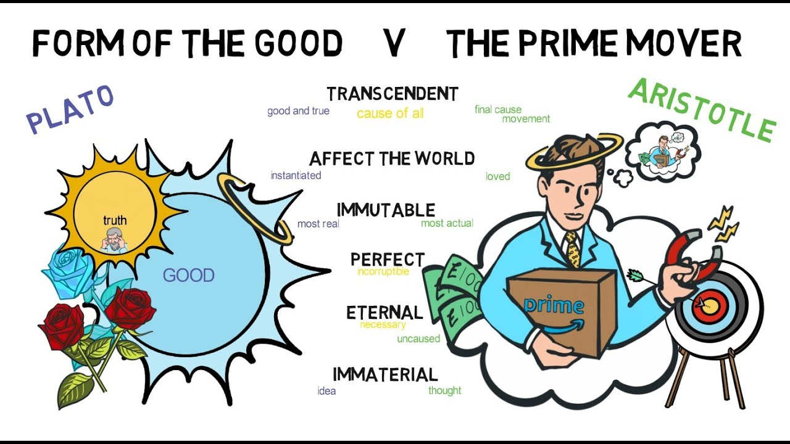

+ Project title: **The Legacy of Socrates: the dichotomy of the greatest figures of Western philosophy, does everything have to be polarized?**
+ This project is conducted by Namira Suniaprita

+ Project summary: The philosophies of Plato and Aristotle are viewed differently by various scholars and fans. Some see Aristotle's philosophy as straightforward and lacking depth, while others criticize Plato's ideas as overly complex and outdated. It is intriguing to compare these differing perspectives as both refer back to the beliefs of their common teacher, Socrates.

This project aims to answer this big question: Putting aside their philosophical ideas, how do their works differ in terms of their writing style and the sentiment conveyed in their writings?

1. Writings: Despite having a teacher-student relationship,  how does Plato’s writings differ from Aristotle's in terms of most frequent words and length of sentences? 

 2. Sentiment: Do Plato and Aristotle have different sentiments? If yes, how far is the difference in terms of emotion fluctuations? And do they convey more positive or negative messages?

This project utilized multiple text mining techniques and sentiment analysis on writings of both Plato and Aristotle works to address the questions.

The results are showing that: (1) An analysis of the language used in the writings of Plato and Aristotle reveals similarities, as both writers often used words such as "one", "things", "say", and "good". (2) Additionally, their works differ in terms of sentence lengths, as demonstrated by variations in statistical figures. Aristotle's works appear to have a greater number of words, while Plato's tend to have more moderate length. (3) A common theme of positivity runs throughout both writers' works, with trust and anticipation being the predominant emotions. However, a difference can be observed in the emotions portrayed, as Aristotle's works have a higher likelihood of expressing fear, while Plato's are more often associated with joy. (4) It is important to note that for the purpose of simplicity, the analysis only classifies the emotion with the highest and mean score for each sentence, without considering the nuanced nature of mixed emotions in a sentence.


Following [suggestions](http://nicercode.github.io/blog/2013-04-05-projects/) by [RICH FITZJOHN](http://nicercode.github.io/about/#Team) (@richfitz). This folder is orgarnized as follows.

```
proj/
├── lib/
├── data/
├── doc/
├── figs/
└── output/
```

Please see each subfolder for a README file.

